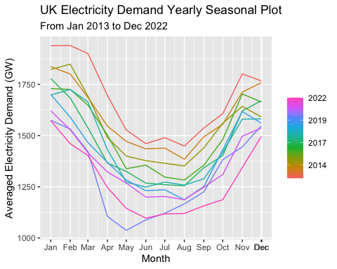

UK Energy Consumption Forecast with ETS Methods
================
Teik Keat Tee
2023-12-12

------------------------------------------------------------------------

## 1. Introduction and Data Description

The time series data of interest for this assignment is UK’s Historical
Electricity Demand from 2013 to 2022, which is a published data source
obtained from [**UK National Grid
ESO**](https://www.nationalgrideso.com/data-portal/historic-demand-data?page=0).

The original data contains a bi-hourly recorded series of energy demand,
wind, solar data etc., where we are only interested in the columns
‘settlement_date’ and ‘nd’.

The bi-hourly recorded series will be first aggregated into **daily**
frequency based on ‘settlement_date’. Then, the **monthly** series will
be obtained through averaging the daily series, as this eliminates the
effect of different calendar days in each month.

The reason for our selection of monthly forecasting in our exercise is
mainly due to the restriction from the complexity of daily series
forecasting, which is unable to be handled by the models under the scope
of this assignment. These difficulties arise from multi-seasonality
effects and noises in daily series (see appendix 9.1). Therefore,
aggregating the data to monthly level makes it more manageable.

The column ‘nd’ contains sum of metered power generation, excluding
generation required to meet station load, pump storage pumping and
interconnector exports. This complies with National Grid ESO operational
generation metering and the Great Britain generation reporting
requirement. The electricity demand is measured in MW (megawatts).

The 10 years time-frame has been selected due to its perseverance of any
cyclical dynamics, although we do not observed it in the analysis.

*\* Note that to achieve brevity and ensure originality, the raw csv
files were pre-processed by simply combining the yearly publication into
one csv file manually. However, further data processing will be done in
Section 2.*

------------------------------------------------------------------------

## 2. Preliminaries

Prior to the analyses, some preliminary steps should be taken care of.
These include data extraction and processing, as well as importing
dependencies.

## 2.1 Import Dependencies

``` r
library(fpp3) # [v0.5] For analysing, plotting, forecasting, data wrangling etc.
```

## 2.2 Data Extraction and Processing

``` r
# Extracting the raw data from github to a data frame
# Truncating the file path to ensure visibility
elec_raw_df <- data.frame(
  read.csv(paste0("https://raw.githubusercontent.com/teikkeat80/", 
  "UK_Energy_Consumption_Forecast_ETS/main/energy_data/uk_elec_2012_2022.csv")))

# Extracting the subset of data of interest mentioned in Section 1.
elec_df <- elec_raw_df %>% 
  select(settlement_date, nd) %>% 
  # Aggregation of demand into gigawatt (GW) since here we are looking 
  # at a national daily level
  mutate(nd = nd * 10^-3) %>% 
  group_by(settlement_date) %>% 
  summarise(nd = sum(nd))
  
# Rename columns for better coding practice
colnames(elec_df) <- c("date", "demand")

# Convert dataset to suitable time series
elec_ts_daily <- elec_df %>% 
  mutate(
    # Convert date column with different date format to date type variables
    # The change of date format was due to change of reporting format since 2022
    date = ifelse(grepl(".*-[A-Z]*-.*", date), 
                  as.Date(date, format = "%d-%h-%Y"), 
                  as.Date(date, format = "%Y-%m-%d")),
    date = as.Date(date, origin = "1970-01-01")) %>% 
  arrange(date) %>% 
  as_tsibble(index = date)
  
# Aggregating data series into monthly series
elec_ts_monthly <- elec_ts_daily %>% 
  mutate(month = yearmonth(date), 
         demand = round(demand, 2)) %>% 
  as_tibble() %>% 
  select(-date) %>% 
  group_by(month) %>% 
  summarise(demand = mean(demand)) %>% 
  as_tsibble(index = month)
```

The dependencies and processed time series data are now ready for the
analysis. Our prepared data set here contains 120 observations.

------------------------------------------------------------------------

## 3. Visualisations and Exploratory Data Analysis

The following plots were produced to illustrate the dynamics of our data
concerning UK’s electricity consumption.

- Monthly time plot
- Yearly seasonal plot

As the monthly data series is of main interest, the monthly plot is
simply the time plot.

*\* Note that we have also provided the daily time plot and weekly
seasonal plot in appendix 9.1 to explain the reasoning behind carrying
out monthly forecasting as the focus of our exercise.*

``` r
# Generating monthly plot using autoplot()
elec_ts_monthly %>% 
  autoplot(demand) + 
  labs(title = "UK Electricity Demand Monthly Plot", 
       subtitle = "From Jan 2013 to Dec 2022", 
       y = "Averaged Electricity Demand (GW)", 
       x = "Month")
```

<!-- -->

From the monthly time plot itself, we can clearly observe a yearly
seasonal pattern in the UK National Electricity Demand series. The
seasonal pattern can be mainly attributed to the varying electricity
consumption in different weathers, which will be explained further in
the seasonal plot analysis. Furthermore, the seasonal pattern observed
here seems to be in similar magnitude for each season; such additive
behaviour will be modeled into our forecasting methods later.

Besides, the series exhibits a downwards trend over the decade, where it
begins to become flattened from 2017 onwards (if we ignore 2020 and
2022). The main reason behind this was the introduction of a series of
energy efficient policies by the UK government throughout these years,
which managed to control national-level electricity consumption while
promoting sustainability. Examples of these policies in place include
the introduction of effective efficiency improvement schemes (such as
ECO, MEES, etc.), and implementation of advanced technologies such as
smart electrical appliances. Despite the success of these policies,
there remained an upside drive by digitalisation and increasing
population especially in later years, which explains the flattened
trend.

We also observe a significant drop in the magnitude of electricity
demand during year 2020. This is attributed to the initial lockdown
which UK government enforced in response to the COVID-19 outbreak. Many
businesses including services, commercials and industrial sectors were
forced to shut down, and subsequently reduced the national electricity
consumption. A bounce back occurred later in the year when these
restrictions were removed. Apart from this, another significant drop in
electricity demand had occurred during the first half of the year of
2022. This was in light of the geopolitical-driven energy crisis, where
the electricity prices had been surging due to supply-side factors
(e.g. Russian-Ukraine Conflict). We keep this in mind during our
analysis.

The monthly time plot summarises the overall pattern of UK’s electricity
demand from year 2013 to 2022. Next, we will be looking at the yearly
seasonal plot.

``` r
# Generating yearly seasonal plot using gg_season
elec_ts_monthly %>% 
  gg_season(demand, period = "year") + 
  labs(title = "UK Electricity Demand Yearly Seasonal Plot", 
       subtitle = "From Jan 2013 to Dec 2022", 
       y = "Averaged Electricity Demand (GW)", 
       x = "Month")
```

<!-- -->

As suggested from the monthly time plot, the UK Electricity Consumption
series demonstrates a yearly seasonality. The seasonal plot shows that
there is a decreasing trend from the beginning of each year until July,
while it increases again towards the end of the year. This is mainly due
to the additional electricity consumption during winter days.

Winter begins around November, where temperature can potentially drop to
around -3 to 7 Degree Celsius. The high electricity consumption is
mainly attributed to the widespread usage of electrical heating devices
and increasing lighting usage (as daylight time is shorter). Peak
electricity consumption is usually observed in January.

The electricity consumption gradually decreases as temperature increases
and daylight time becomes longer, where the demand hits lowest during
summer (July). Interestingly, this contrasts with the phenomenon seen in
other locations with seasonal weather (e.g. Australia). This is because
most UK buildings generally does not have built-in cooling systems due
to a much milder summer.

Apart from that, we can also observe that there is a slight drop in
electricity consumption in the month of December for some years, which
reflects the effect of holiday seasons (Christmas and New Year), where
companies and offices are closed for celebrations.

------------------------------------------------------------------------

## 4. Forecast with Holt-Winters’ Method

From this section onwards, we model the data series in an experimental
manner by employing several appropriate models. Then, we evaluate the
forecasting performance of our models. To do this, we first split our
data into training and testing samples using the common 70:30 ratio,
where we leave the last 3 years of our data for testing purpose. This
ensures a reliable indication of the accuracy of the fitted model.

``` r
# Split into train and test set
elec_train <- elec_ts_monthly %>% 
  filter_index(. ~ "2019-12-31")

elec_test <- elec_ts_monthly %>% 
  filter_index("2020-01-01" ~ .)
```

Given the exploratory data analysis in Section 3, we have observed an
**additive** seasonal behaviour from our data series. Apart from that,
we have also observed a diminishing trend behaviour towards recent
years. As such, we first consider the **Holt-Winters’ Additive with
Damped Trend method**.

``` r
# Fitting the model
elec_fit_hwad <- elec_train %>% 
  model(hwad = ETS(demand ~ error("A") + trend("Ad") + season("A")))

# Generate model fit report
elec_fit_hwad %>% 
  report()
```

    ## Series: demand 
    ## Model: ETS(A,Ad,A) 
    ##   Smoothing parameters:
    ##     alpha = 0.0003128811 
    ##     beta  = 0.0001063289 
    ##     gamma = 0.0002998493 
    ##     phi   = 0.9785618 
    ## 
    ##   Initial states:
    ##      l[0]    b[0]     s[0]    s[-1]     s[-2]     s[-3]     s[-4]  s[-5]
    ##  1718.105 -7.9478 156.4816 153.6775 -24.27237 -118.6003 -210.1614 -180.1
    ##      s[-6]    s[-7]     s[-8]    s[-9]   s[-10]   s[-11]
    ##  -175.9255 -146.706 -48.87324 128.6958 223.1111 242.6727
    ## 
    ##   sigma^2:  1507.74
    ## 
    ##      AIC     AICc      BIC 
    ## 1003.937 1014.460 1047.692

``` r
# Generate forecast
elec_fc_hwad <- elec_fit_hwad %>% 
  forecast(elec_test)

# Plot forecasted series alongside the last few years in the training data
elec_fc_hwad %>% 
  autoplot(filter(elec_train, year(month) > 2017), colour = "red") + 
  autolayer(elec_test, demand, colour = "navy") + 
  labs(y = "Averaged Electricity Demand (GW)", 
       title = "UK's Electricity Demand Forecast",
       subtitle = "with ETS(A,Ad,A)", 
       x = "Month"
       ) + 
  theme_minimal()
```

<!-- -->

From the graph above we observe that the forecast with Holt-Winters’
Additive and Damped Trend method seems to be rather accurate for the
year of 2021, where the bounce back from COVID period tends to be
addressed by the damping parameters. However, there seems to be some
deviations between the forecasted series and the actual series for the
years of 2020 and 2022. This result is consistent with what we have
suggested earlier about the crisis periods. Nevertheless, we consider
this as one of our tentative models, and evaluate it with other models.
Note that we cannot reach any conclusions from this forecast as there
remains further work to be done (residual diagnostics and comparative
analysis with other models, will address later).

------------------------------------------------------------------------

## 5. Holt-Winters’ Additive/Multiplicative Seasonality

In this section we attempt to describe the additive seasonality that we
have employed in more detail.

Including the model in Section 4, most models in this assignment are
mostly based on the Holt-Winters’ method - which was an extended model
from Holt’s Linear method (1957) by Holt and Winters (1960).
Holt-Winters introduces a seasonal component to capture seasonality.
Note that the presence of seasonality is apparent even from visual
check, so this rules out models that do not incorporate any form of
seasonality (e.g. simple exponential smoothing, whose forecast is flat
equal to the last level)

The seasonal component here can be described by two kinds of behaviour,
whether it is additive or multiplicative. Additive seasonality is
appropriate when the seasonal fluctuations are relatively constant
across all levels of the series, while multiplicative seasonality tends
to be employed when the magnitude of seasonal variations is proportional
to the level of the series. Since the seasonal variation throughout each
years in our data series seems to be in a similar magnitude, we are
motivated to employ additive instead of multiplicative seasonality for
our models. (However, it might also be true that whether additive or
multiplicative behaviour could not be easily differentiated by looking
at the plots - we will address this later.)

This additive behaviour indicates that the difference between summer and
winter electricity usages remains constant. In fact, the differences
between the months with highest and lowest electricity consumption
throughout the years stay in the range around 32 ~ 43% (with the
exception year 2020, see appendix 9.2). Given the time frame (10 years)
we consider for our data series, this phenomenon is sensible, as we
should assume that a change of climate-driven seasonal pattern such as
increasing/decreasing seasonal temperature differences and daylight time
could only be detected in time series with longer horizon
(e.g. decades).

------------------------------------------------------------------------

## 6. Additional ETS/Other Models

In this section, we continue to consider several other models and
methods.

Apart from the trend and seasonal component, ETS models can be adjusted
in a statistical sense by considering the behaviour of errors. The error
component can be additive or multiplicative, where the prediction
intervals behave differently depending on the type. The identification
of the correct kind of errors’ behaviour can be done via comparing
selection criteria values such as AICc, AIC and BIC. Therefore, we
simply employ the automated ETS function in R to determine whether our
model fit contains additive or multiplicative errors, where the
automated ETS function simply selects the model with lowest AICc values.

``` r
# Fitting the model
elec_fit_auto <- elec_train %>% 
  model(ets_auto = ETS(demand))

# Generate report
elec_fit_auto %>% 
  report()
```

    ## Series: demand 
    ## Model: ETS(M,Ad,A) 
    ##   Smoothing parameters:
    ##     alpha = 0.0001009834 
    ##     beta  = 0.0001003217 
    ##     gamma = 0.0001003416 
    ##     phi   = 0.9798677 
    ## 
    ##   Initial states:
    ##      l[0]      b[0]     s[0]    s[-1]     s[-2]     s[-3]     s[-4]     s[-5]
    ##  1718.353 -7.750872 155.9071 158.3837 -18.04436 -117.5024 -202.5215 -181.7439
    ##      s[-6]     s[-7]     s[-8]    s[-9]   s[-10]   s[-11]
    ##  -176.2541 -149.9174 -49.91735 118.7152 220.4457 242.4492
    ## 
    ##   sigma^2:  6e-04
    ## 
    ##       AIC      AICc       BIC 
    ##  994.8985 1005.4215 1038.6532

The automated ETS function tends to suggest a similar trend and seasonal
component. However, it seems that the multiplicative error tends to
provide a better fit. We have observed lower AIC, AICc and BIC values
from the multiplicative error model in comparison to additive error
model. This can have resulted from the heteroscedasticity in our data
series’ variances. The effect can be captured by multiplicative error
models, and they are also physically appropriate to our use case as
electricity demand should not be negative after all. As such, we proceed
with multiplicative error models going forward.

Apart from the adjustment in errors, we also employ the Guerrero’s
method to determine whether there is an optimal lambda that can minimise
the variations in our data.

``` r
# Obtain the Guerrero's lambda
lambda <- elec_train %>% 
  features(demand, features = guerrero) %>% 
  pull(lambda_guerrero)

# Print out result
print(paste0("Guerrero's Lambda: ", round(lambda, 6)))
```

    ## [1] "Guerrero's Lambda: 1.125108"

The lambda value of 1.125 (close to 1) suggests that transformation
might not be as useful. As a result, we simply do not consider any
transformation. We suppose that any kind of variation in our data
(e.g. trend/seasonal) should be able to modelled into the ETS models
with the correct specifications.

Combining the model and information we have at this point, we employ the
following models in our forecasting process:

- ETS (Additive Seasonality and Damped Trend) \[ETS(A,Ad,A)\]
- ETS (Additive Seasonality and Damped Trend with Multiplicative Errors)
  \[ETS(M,Ad,A)\]
- Seasonal Naive \[SNAIVE\]
- ETS (Additive Seasonality and Damped Trend with Multiplicative Errors)
  on STL Seasonally Adjusted series \[STL+ETS(M,Ad,N)\]

``` r
# Fit the models
elec_fit_all <- elec_train %>% 
  model(ets_aada = ETS(demand ~ error("A") + trend("Ad") + season("A")), 
        ets_mada = ETS(demand ~ error("M") + trend("Ad") + season("A")), 
        snaive = SNAIVE(demand), 
        ets_madn_stl = decomposition_model(
          STL(demand, robust = TRUE), 
          ETS(season_adjust ~ error("M") + trend("Ad") + season("N"))))

# Generate forecast
elec_fc_all <- elec_fit_all %>% 
  forecast(elec_test)
```

``` r
# Generate point forecast plots with more recent years
elec_fc_all %>% 
  autoplot(filter(elec_train, year(month) > 2017), level = NULL) + 
  autolayer(elec_test, demand, colour = "navy") + 
  labs(y = "Averaged Electricity Demand (GW)", 
       title = "Electricity Demand Point Forecasts",
       subtitle = "with Multiple Models", 
       x = "Month") + 
  theme_minimal()
```

<!-- -->

From above point forecasts graph, it seems difficult to tell which model
has a better forecasting performance, apart from the observation that
the seasonal naive model tends to be diverging the most from the actual
values. Therefore, we explore these models with a more thorough manner
in Section 7.

------------------------------------------------------------------------

## 7. Forecast and Residual Analysis

In this section we present a detail in-sample exploration for the all
models we have. Then, we evaluate the selected models’ (from in-sample
analysis) out-of-the-sample forecast accuracy through comparing
different forecasting performance metrics.

## 7.1 In-Sample Residual Analysis

In order to determine which model tends to have the best in-sample fit,
we evaluate both the residuals’ behaviour and the model’s information
criteria values (AIC, AICc, BIC).

``` r
# Generate residuals plots
elec_fit_all %>% 
  select(ets_aada) %>% 
  gg_tsresiduals() + 
  labs(title = "ETS(A,Ad,A) residual plots")
```

<!-- -->

``` r
# Generate residuals plots
elec_fit_all %>% 
  select(ets_mada) %>% 
  gg_tsresiduals() + 
  labs(title = "ETS(M,Ad,A) residual plots")
```

<!-- -->

``` r
# Generate residuals plots
elec_fit_all %>% 
  select(snaive) %>% 
  gg_tsresiduals() + 
  labs(title = "SNAIVE residual plots")
```

<!-- -->

``` r
# Generate residuals plots
elec_fit_all %>% 
  select(ets_madn_stl) %>% 
  gg_tsresiduals() + 
  labs(title = "STL+ETS(M,Ad,N) residual plots")
```

<!-- -->

From the residual plots, we observe that apart from SNAIVE, all models
seem to have residuals varying around 0 with small variance. Apart from
this behaviour, the ACF plots and histograms show that our models’
residuals do not conform to a “desirable fitted models’ residuals”.
There seem to be 1st-, 11th-, and 12th-order autocorrelated residuals
for all models. Moreover, the histograms do not convince us that the
residuals follow the normality assumption. Nevertheless, we employ
statistical tests to assess the residual behaviours formally.

``` r
# Mean evaluation
mean_eval_fn <- function (mable) {
  result <- mable %>% 
    augment() %>% 
    as_tibble() %>% 
    group_by(.model) %>% 
    summarise(mean = round(mean(.innov, na.rm = TRUE), 6))
  return(result)
}

elec_fit_mean <- mean_eval_fn(elec_fit_all)

# Autocorrelation evaluation (Ljung-Box Test)
lb_eval_fn <- function (mable) {
  result <- mable %>% 
    augment() %>%  
    # Setting the lag as min{T/5,2m}, where T is the number of observations 
    # and m is the seasonal period 
    features(.innov, ljung_box, lag = min(nrow(elec_train) / 5, 2 * 12)) %>% 
    mutate(lb_stat = round(lb_stat, 6), lb_pvalue = round(lb_pvalue, 6))
  return(result)
}

elec_fit_acf <- lb_eval_fn(elec_fit_all)

# Normality evaluation (Shapiro-Wilk Test)
sw_eval_fn <- function (mable) {
  result <- mable %>% 
    augment() %>% 
    as_tibble() %>% 
    group_by(.model) %>% 
    summarise(sw_stat = round(shapiro.test(.innov)$statistic, 6), 
              sw_pvalue = round(shapiro.test(.innov)$p.value, 6))
  return(result)
}

elec_fit_norm <- sw_eval_fn(elec_fit_all)

# Show residuals diagnostics result
inner_join(elec_fit_mean, 
           inner_join(elec_fit_acf, elec_fit_norm, by = '.model'))
```

    ## # A tibble: 4 × 6
    ##   .model             mean lb_stat lb_pvalue sw_stat sw_pvalue
    ##   <chr>             <dbl>   <dbl>     <dbl>   <dbl>     <dbl>
    ## 1 ets_aada       0.377       56.3  0.000004   0.988     0.598
    ## 2 ets_mada       0.000394    51.2  0.000025   0.992     0.905
    ## 3 ets_madn_stl   0.488       42.5  0.000513   0.988     0.702
    ## 4 snaive       -44.3         74.7  0          0.986     0.627

From above table, we observe that the mean of residuals tends to be
close to zero (apart from the SNAIVE model, which reported a downward
bias), thus confirming what we observe from the plots. This result
indicates our point forecasts generated by the ETS models is unbiased.

Apart from this, the Portmanteau test result (low p-values/high
Ljung-Box statistic) shows that all of the models do not satisfy the
white noise assumption. The result is similar to what we observe from
the ACF plots. This indicates that there is some information left over
in the residuals where our models might not be complete.

Suprisingly, the large p-values from the Shapiro-Wilk normality test
shows that our models are somehow satisfying the normal residuals
assumptions, where we do not have enough evidence to reject the null
hypothesis of normal residuals. The result suggests that the histogram
plots might be misleading, and this situation might arise from the lack
of data points.

In order to address the bias from the SNAIVE model and autocorrelated
residuals from all the models, we employ a trial-and-error approach and
consider various transformations and parameter adjustments (for brevity
we do not show it here). We find that adding a drift component tends to
eliminate the bias from SNAIVE and make it comparable to the rest of the
models.

Besides, we also find that considering a multiplicative seasonality and
setting a higher alpha parameter (only for multiplicative error models)
tend to increase the chances for the white noise assumption to be true.
We select alpha = 0.4 for the best trade-off between residuals’
behaviour and AICc results. Note that the multiplicative seasonality
corresponds to our earlier discussion on possibly not being able to
identify the actual effect through visualisations (or it could also be
that we are lacking exogeneous regressors to accompany the additive
behaviour, nevertheless, multiplicative seasonality addresses this
issue).

``` r
# Modification of the model
elec_fit_all_mod <- elec_train %>% 
  model(ets_aadm_mod = ETS(demand + 2 ~ error("A") + trend("Ad") + season("M")), 
        ets_madm_mod = ETS(demand ~ error("M") + trend("Ad", alpha = 0.4) + season("M")), 
        snaive_mod = SNAIVE(demand ~ drift()), 
        ets_madn_stl_mod = decomposition_model(
          STL(demand, robust = TRUE), 
          ETS(season_adjust ~ error("M") + trend("Ad", alpha = 0.4) + season("N"))))

# Statistical Test (Not plotting residuals to save space)
elec_fit_mean_mod <- mean_eval_fn(elec_fit_all_mod)
elec_fit_acf_mod <- lb_eval_fn(elec_fit_all_mod)
elec_fit_norm_mod <- sw_eval_fn(elec_fit_all_mod)

# Show result
inner_join(elec_fit_mean_mod, 
           inner_join(elec_fit_acf_mod, elec_fit_norm_mod, by = '.model'))
```

    ## # A tibble: 4 × 6
    ##   .model               mean lb_stat lb_pvalue sw_stat sw_pvalue
    ##   <chr>               <dbl>   <dbl>     <dbl>   <dbl>     <dbl>
    ## 1 ets_aadm_mod     -0.527      32.5  0.0121     0.991     0.805
    ## 2 ets_madm_mod     -0.00119    33.7  0.00849    0.990     0.754
    ## 3 ets_madn_stl_mod  0.174      40.9  0.000861   0.994     0.986
    ## 4 snaive_mod        0          74.7  0          0.986     0.627

Through the modifications, we observe that there is a significant
reduction in the Ljung-Box statistic for the ETS models, while the mean
of SNAIVE with Drift model has reduced to 0. This has been achieved
while keeping the unbiased estimator and normality assumption to be
true. Note that we have accounted for the small bias for our Additive
Error ETS model by adding constant 2 to the demand series. Although the
p-values still remain low, this is the best we can achieve under the
scope of considering only ETS models. Ultimately, the Ljung-Box test
might not provide a desirable outcome after all since we have a long
seasonality period (12) and our data points are not as many.

Information Criteria (IC) values such as AIC, AICc, and BIC employ a
robust method to minimise the SSE of ETS models, therefore helping us in
the model selection process. Next, we examine the AIC, AICc, and BIC of
all the ETS models we have until this point.

``` r
# Generate table for comparing IC values
elec_fit_all_report <- elec_fit_all %>% 
  # As glance() does not support mix models, we will report it separately
  # SNAIVE won't have IC values
  select(-ets_madn_stl, -snaive) %>% 
  glance() %>% 
  select(.model, AIC, AICc, BIC)

elec_fit_all_mod_report <- elec_fit_all_mod %>% 
  select(-ets_madn_stl_mod, -snaive_mod) %>% 
  glance() %>% 
  select(.model, AIC, AICc, BIC)

# Show result
rbind(elec_fit_all_report, elec_fit_all_mod_report)
```

    ## # A tibble: 4 × 4
    ##   .model         AIC  AICc   BIC
    ##   <chr>        <dbl> <dbl> <dbl>
    ## 1 ets_aada     1004. 1014. 1048.
    ## 2 ets_mada      995. 1005. 1039.
    ## 3 ets_aadm_mod 1017. 1028. 1061.
    ## 4 ets_madm_mod 1010. 1019. 1051.

``` r
# Show mix-models results individually
elec_fit_all %>% 
  select(ets_madn_stl) %>% 
  report()
```

    ## Series: demand 
    ## Model: STL decomposition model 
    ## Combination: season_adjust + season_year
    ## 
    ## ========================================
    ## 
    ## Series: season_adjust 
    ## Model: ETS(M,Ad,N) 
    ##   Smoothing parameters:
    ##     alpha = 0.1751907 
    ##     beta  = 0.0001000101 
    ##     phi   = 0.9688796 
    ## 
    ##   Initial states:
    ##      l[0]      b[0]
    ##  1759.438 -11.48786
    ## 
    ##   sigma^2:  6e-04
    ## 
    ##       AIC      AICc       BIC 
    ##  987.5861  988.6770 1002.1710 
    ## 
    ## Series: season_year 
    ## Model: SNAIVE 
    ## 
    ## sigma^2: 2.1046

``` r
elec_fit_all_mod %>% 
  select(ets_madn_stl_mod) %>% 
  report()
```

    ## Series: demand 
    ## Model: STL decomposition model 
    ## Combination: season_adjust + season_year
    ## 
    ## ========================================
    ## 
    ## Series: season_adjust 
    ## Model: ETS(M,Ad,N) 
    ##   Smoothing parameters:
    ##     alpha = 0.4 
    ##     beta  = 0.0001000024 
    ##     phi   = 0.9671801 
    ## 
    ##   Initial states:
    ##      l[0]      b[0]
    ##  1759.869 -11.56975
    ## 
    ##   sigma^2:  6e-04
    ## 
    ##      AIC     AICc      BIC 
    ## 987.5914 988.3606 999.7455 
    ## 
    ## Series: season_year 
    ## Model: SNAIVE 
    ## 
    ## sigma^2: 2.1046

From above information, it seems that the modifications have slightly
increased the AIC, AICc, and BIC values of all the non-mixed models.
However, we notice that for some models, this trade-off is relatively
minimal for getting a better residuals’ behaviour. Note that we do not
directly compare the IC values of the STL-mixed models with other ETS
models, as the IC values from mixed-model were only calculated against
the seasonal adjusted series instead of the demand series itself. Given
above results, the model selection process is subjective. We therefore
select the following models for forecast performance evaluation:

- ETS(A,Ad,M) : The modified version, as it gives a much lower Ljung-Box
  statistic.
- ETS(M,Ad,A) : Lowest IC values among all non-mixed ETS model, the
  modified version trade-off does not seems too desirable.
- SNAIVE with Drift : Simply makes sense and it is more comparable.
- STL+ETS(M,Ad,N) : The modified version is better in all terms (IC
  values and Residual behaviour).

``` r
# Fit model for our selected models
elec_fit_all_final <- elec_train %>% 
  model(ets_mada = ETS(demand ~ error("M") + trend("Ad") + season("A")), 
        ets_aadm_mod = ETS(demand + 2 ~ error("A") + trend("Ad") + season("M")), 
        snaive_mod = SNAIVE(demand ~ drift()), 
        ets_madn_stl_mod = decomposition_model(
          STL(demand, robust = TRUE), 
          ETS(season_adjust ~ error("M") + trend("Ad", alpha = 0.4) + season("N"))))
```

## 7.2 Out-of-the-Sample Forecast Performance Analysis

Next, we evaluate the forecast performance of the selected models from
Section 7.1 using the test data. As all models here satisfy the
normality assumption, we consider their prediction intervals in a
simpler manner (i.e. not considering bootstrap etc.).

``` r
# Generate forecasts
elec_fc_all_final <- elec_fit_all_final %>% 
  forecast(elec_test)

# Generate point forecast plots with more recent years
elec_fc_all_final %>% 
  autoplot(filter(elec_train, year(month) > 2017), level = NULL) + 
  autolayer(elec_test, demand, colour = "navy") + 
  labs(y = "Averaged Electricity Demand (GW)", 
       title = "Electricity Demand Point Forecasts",
       subtitle = "with Multiple Models (Final)", 
       x = "Month") + 
  theme_minimal()
```

<!-- -->

Similarly, the point forecast plot does not convey too much information.
However, it shows that there is a better performance for the SNAIVE with
drift model comparing to the original SNAIVE model. Besides, in terms of
the ETS models, we also observe that the STL+ETS(M,Ad,N) model tends to
depart the most from the peaks, whereas ETS(A,Ad,M) model tends to
depart the most from the troughs. Nevertheless, to critically assess the
performance of the models, we consider the interval forecast plots and
the accuracy measures.

``` r
# Generate interval forecast plots for ETS(M,Ad,A)
elec_fc_all_final %>% 
  filter(.model == "ets_mada") %>% 
  autoplot(filter(elec_train, year(month) > 2017), colour = "red") + 
  autolayer(elec_test, demand, colour = "navy") + 
  labs(y = "Averaged Electricity Demand (GW)", 
       title = "Electricity Demand Interval Forecasts",
       subtitle = "with ETS(M,Ad,A)", 
       x = "Month") + 
  theme_minimal()
```

<!-- -->

``` r
# Generate interval forecast plots for ETS(A,Ad,M)
elec_fc_all_final %>% 
  filter(.model == "ets_aadm_mod") %>% 
  autoplot(filter(elec_train, year(month) > 2017), colour = "red") + 
  autolayer(elec_test, demand, colour = "navy") + 
  labs(y = "Averaged Electricity Demand (GW)", 
       title = "Electricity Demand Interval Forecasts",
       subtitle = "with ETS(A,Ad,M)", 
       x = "Month") + 
  theme_minimal()
```

<!-- -->

``` r
# Generate interval forecast plots for ETS(M,Ad,A)
elec_fc_all_final %>% 
  filter(.model == "ets_madn_stl_mod") %>% 
  autoplot(filter(elec_train, year(month) > 2017), colour = "red") + 
  autolayer(elec_test, demand, colour = "navy") + 
  labs(y = "Averaged Electricity Demand (GW)", 
       title = "Electricity Demand Interval Forecasts",
       subtitle = "with STL+ETS(M,Ad,N)", 
       x = "Month") + 
  theme_minimal()
```

<!-- -->

``` r
# Generate interval forecast plots for ETS(M,Ad,A)
elec_fc_all_final %>% 
  filter(.model == "snaive_mod") %>% 
  autoplot(filter(elec_train, year(month) > 2017), colour = "red") + 
  autolayer(elec_test, demand, colour = "navy") + 
  labs(y = "Averaged Electricity Demand (GW)", 
       title = "Electricity Demand Interval Forecasts",
       subtitle = "with SNAIVE with Drift", 
       x = "Month") + 
  theme_minimal()
```

<!-- -->

``` r
# Generate accuracy table
accuracy(elec_fc_all_final, elec_test)
```

    ## # A tibble: 4 × 10
    ##   .model           .type     ME  RMSE   MAE    MPE  MAPE  MASE RMSSE  ACF1
    ##   <chr>            <chr>  <dbl> <dbl> <dbl>  <dbl> <dbl> <dbl> <dbl> <dbl>
    ## 1 ets_aadm_mod     Test  -93.6  113.   93.8 -7.55   7.56   NaN   NaN 0.568
    ## 2 ets_mada         Test  -74.7   98.0  76.6 -5.99   6.14   NaN   NaN 0.553
    ## 3 ets_madn_stl_mod Test  -86.1  107.   87.2 -6.85   6.93   NaN   NaN 0.531
    ## 4 snaive_mod       Test   -6.92  77.1  56.4 -0.719  4.55   NaN   NaN 0.447

``` r
# Generate accuracy table for non-crisis period
accuracy(filter(elec_fc_all_final, year(month) == 2021), 
         filter(elec_test, year(month) == 2021))
```

    ## # A tibble: 4 × 10
    ##   .model           .type    ME  RMSE   MAE   MPE  MAPE  MASE RMSSE  ACF1
    ##   <chr>            <chr> <dbl> <dbl> <dbl> <dbl> <dbl> <dbl> <dbl> <dbl>
    ## 1 ets_aadm_mod     Test  -45.6  55.0  46.1 -3.35  3.39   NaN   NaN 0.138
    ## 2 ets_mada         Test  -27.0  44.1  32.1 -1.89  2.29   NaN   NaN 0.341
    ## 3 ets_madn_stl_mod Test  -38.6  50.1  41.9 -2.73  2.99   NaN   NaN 0.391
    ## 4 snaive_mod       Test   39.9  55.8  50.6  3.12  3.88   NaN   NaN 0.244

According to the plots, it seems that apart from the ETS(M,Ad,A) model
and year of 2020, all actual values from the test data seem to lie in
the 95% confidence interval. In terms of their relative point forecasts,
ETS(M,Ad,A) and SNAIVE with Drift seem to be more accurate than others.
However, the increasing width of the prediction intervals for SNAIVE
with Drift and ETS(A,Ad,M) implies the large uncertainty for the
forecasts when we are looking at further periods.

In terms of the accuracy table, the result is somehow suprising. SNAIVE
with Drift Method seems to have the lowest RMSE and MAE, followed by
ETS(M,Ad,A) model. Nevertheless, this was due to the crisis period in
2020 and 2022 in our test dataset, where the deviations from the ETS
models’ forecasts to actual values tend to be large. As it makes no
sense to conclude which model is better during crisis periods (anything
can happen), therefore, we separate the test data and examine only on
the non-crisis period (i.e., year 2021). The result is convincing, as we
observe **ETS(M,Ad,A)** tends to provide the best out-of-the-sample
forecast in terms of RMSE and MAE, followed by STL+ETS(M,Ad,N), and the
basic SNAIVE with Drift model is the worst.

------------------------------------------------------------------------

## 8. Conclusion and remarks

From the residual analysis above, we have shortlisted 4 candidate
models, namely ETS(M,Ad,A), Modified STL+ETS(M,Ad,N), SNAIVE with Drift,
and Modified ETS(A,Ad,M). The Modified ETS(A,Ad,M) demonstrates the best
residual behaviour, while ETS(M,Ad,A) provides the lowest IC values in
terms of all single ETS models. Regarding the mixed-models, the modified
STL+ETS(M,Ad,N) model is better than the non-modified STL+ETS(M,Ad,N).

Nevertheless, the whole process and modelling could be improved as we
somehow do not manage to obtain a model that satisfy the desired
residual behaviours, where the issue we face (autocorrelated residuals)
can be critical to our forecast. The main reason behind this could be
the lack of data points or the oversimplicity of ETS models.

In terms of out-of-the-sample forecasting, we finalise ETS(M,Ad,A) as
our best out-of-sample forecasting method for the UK Electricity
Consumption series. Therefore, the ETS(M,Ad,A) model seems to be the
best out of all.

------------------------------------------------------------------------

## 9. Appendix

## 9.1 Why not to proceed with daily electricity demand forecasts

``` r
# Generating time plot using autoplot()
elec_ts_daily %>% 
  autoplot(demand) + 
  labs(title = "UK Electricity Consumption Daily Time Plot", 
       subtitle = "From Jan 2013 to Dec 2022", 
       y = "Averaged Electricity Demand (GW)", 
       x = "Date") + 
  theme_minimal()
```

<!-- -->

From above daily time plot, we have observed a similar trending and
seasonal behaviour from that Section 1 suggested. Additionally, we have
also observed a large variation in the series itself, which represented
the noises in daily series of electricity consumption.

``` r
# Generating weekly seasonal plot using gg_season
elec_ts_daily %>% 
  gg_season(demand, period = "week") + 
  labs(title = "UK Electricity Demand Weekly Seasonal Plot", 
       subtitle = "From Jan 2013 to Dec 2022", 
       y = "Averaged Electricity Demand (GW)", 
       x = "Day of Week") + 
  theme_minimal()
```

<!-- -->

Moreover, above seasonal graph demonstrated a discernible dip of
electricity consumption during weekends. This shows that in addition to
the yearly seasonality that we observed in Section 1, there seems to be
a weekly seasonality. The reason behind this could be closure of
businesses during weekends.

As a result of the dual seasonality and noises consisted in our daily
series, we have decided not to proceed with daily forecasting, due to to
inability of basic ETS models on handling such complications. The daily
series should be instead modeled with more advanced models (such as the
Dual Seasonality Holt-Winters’ or ARIMA method), which falls out of the
scope of this assignment, therefore, we simply do not consider it.

## 9.2 Seasonal range for each year

``` r
# Calculate the differences of seasonal variation for each year
elec_ts_monthly %>% 
  as_tibble() %>% 
  group_by(year = year(month)) %>% 
  summarise(max = max(demand), min = min(demand), 
            diff = round((max - min) * 100 / min, 2)) %>% 
  select(year, diff)
```

    ## # A tibble: 10 × 2
    ##     year  diff
    ##    <dbl> <dbl>
    ##  1  2013  33.9
    ##  2  2014  32.7
    ##  3  2015  36.7
    ##  4  2016  34.8
    ##  5  2017  41.8
    ##  6  2018  38.1
    ##  7  2019  43.4
    ##  8  2020  51.8
    ##  9  2021  36.6
    ## 10  2022  43.4

## Session Info

``` r
sessionInfo()
```

    ## R version 4.3.2 (2023-10-31)
    ## Platform: x86_64-apple-darwin20 (64-bit)
    ## Running under: macOS Ventura 13.2.1
    ## 
    ## Matrix products: default
    ## BLAS:   /Library/Frameworks/R.framework/Versions/4.3-x86_64/Resources/lib/libRblas.0.dylib 
    ## LAPACK: /Library/Frameworks/R.framework/Versions/4.3-x86_64/Resources/lib/libRlapack.dylib;  LAPACK version 3.11.0
    ## 
    ## locale:
    ## [1] en_US.UTF-8/en_US.UTF-8/en_US.UTF-8/C/en_US.UTF-8/en_US.UTF-8
    ## 
    ## time zone: Asia/Kuala_Lumpur
    ## tzcode source: internal
    ## 
    ## attached base packages:
    ## [1] stats     graphics  grDevices datasets  utils     methods   base     
    ## 
    ## other attached packages:
    ##  [1] fable_0.3.4       feasts_0.3.2      fabletools_0.4.1  tsibbledata_0.4.1
    ##  [5] tsibble_1.1.4     ggplot2_3.5.0     lubridate_1.9.3   tidyr_1.3.1      
    ##  [9] dplyr_1.1.4       tibble_3.2.1      fpp3_0.5         
    ## 
    ## loaded via a namespace (and not attached):
    ##  [1] gtable_0.3.4         highr_0.10           crayon_1.5.2        
    ##  [4] compiler_4.3.2       renv_1.0.3           tidyselect_1.2.1    
    ##  [7] Rcpp_1.0.12          scales_1.3.0         ggdist_3.3.2        
    ## [10] yaml_2.3.8           fastmap_1.1.1        R6_2.5.1            
    ## [13] labeling_0.4.3       generics_0.1.3       distributional_0.4.0
    ## [16] knitr_1.45           munsell_0.5.1        pillar_1.9.0        
    ## [19] rlang_1.1.3          utf8_1.2.4           xfun_0.42           
    ## [22] timechange_0.3.0     cli_3.6.2            progressr_0.14.0    
    ## [25] withr_3.0.0          magrittr_2.0.3       digest_0.6.34       
    ## [28] grid_4.3.2           rstudioapi_0.16.0    rappdirs_0.3.3      
    ## [31] lifecycle_1.0.4      anytime_0.3.9        vctrs_0.6.5         
    ## [34] evaluate_0.23        glue_1.7.0           farver_2.1.1        
    ## [37] fansi_1.0.6          colorspace_2.1-0     purrr_1.0.2         
    ## [40] rmarkdown_2.25       tools_4.3.2          pkgconfig_2.0.3     
    ## [43] ellipsis_0.3.2       htmltools_0.5.7
